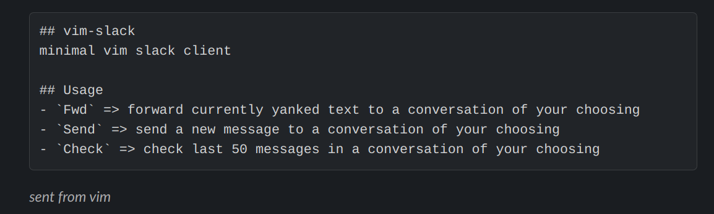

## vim-slack
minimal vim slack client

## Usage
- `Fwd` => forward currently yanked text to a conversation of your choosing
- `Send` => send a new message to a conversation of your choosing
- `Check` => check last 50 messages in a conversation of your choosing

Planned functionality includes:
- Updates around message viewing (reply, etc.)
- Mapping of internal Slack user ID to username for readability
- Support for IM/MPIM conversations

## Setup
You'll need to create a new bot for your Slack workspace to use the plugin.

First hop on over to https://api.slack.com and create a new app. Then navigate
to the Oauth & Permissions tab and add the following scopes:

**USER TOKEN SCOPES**
- `channels:history`
- `groups:history`
- `chat:write`

Then copy the token at the top of this page and assign it to the
following env variable:

- `SLACK_USER_TOKEN` =>  `OAuth Access Token`

Finally, please set your Slack user ID in the `SLACK_USER_ID` env variable.
You can find your ID by opening your profile in Slack and clicking `More`.

## Contributions
Suggestions/contributions always welcome.

## Installation
Using your preferred plugin manager or if all else fails:

`git clone https://github.com/alyosha/vim-slack ~/.vim/bundle/vim-slack`

## Screenshots

